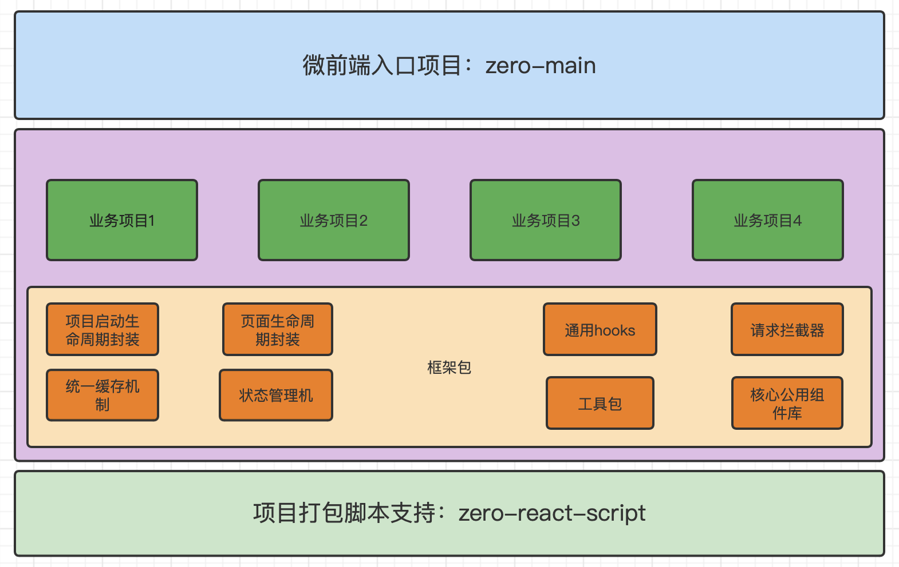

## 项目简介

一个项目从技术选型到承载着大量的业务上线是一个复杂的过程，从项目生命周期管理、页面生命周期管理到 api 和组件的封装以及 css 的规划，随着业务复杂度和页面的增多对应复杂度会成几何倍数增加，如果没有合理的规划，项目越来越难以开发和维护，此项目适用于 PC 端，是基于业务开发过程中总结得出，在技术框架基础上做了业务框架的规划，技术栈采用 `react` `react-router` `redux` `redux-saga` `axios` `antd-mobile` `webpack`，项目分为配置文件、媒体资源以及源码存放，源码中又有公共页面以及组件、业务代码编写以及业务框架抽成以及封装。如果后期项目过大需要做分项目和分模块，则可以把业务框架单独放置一个仓库，各个项目引用该仓库进行多个项目公用公司内部框架。

## 中台建设

关于中台建设技术设计想法浅谈；\
中台的建设一直是一个比较容易忽视但是又比较重要的项目；比较容易忽视则是没有直接的产出，大部分公司则是能买则买，能凑合则凑合，因为即便没有中台，app 和小程序等 toC 的项目
照样能运行。但随着业务越来越多，对 toC 的灵活程度要求越来越高，对于中台才慢慢重视起来，但中台涉及业务繁杂，没有统一的业务设计则很容易失控，从技术角度触发尽量避免一些麻烦是很必要的,
对于中台常见的问题，比如业务模块多，项目使用技术栈不统一、公用逻辑各个业务项目各自为政，重复逻辑不统一，一旦调整容易遗漏等等问题，做了以下设计，让中台即便是面临大的重构也不会无从下手

整体设计思路如下：


根据以上设计做如下项目，拉取代码安装依赖包，则可以直接使用

- [入口项目](https://github.com/jason-gkq/zero-main)
- [核心框架包](https://github.com/jason-gkq/zero-pc)
- [打包脚本](https://github.com/jason-gkq/zero-react-script)

**此项目也可独立使用**

#### 快速开始

```shell
yarn install
yarn start
```

#### 本地访问

```js
http://localhost:8080/
```

#### 打包

```shell
yarn build
yarn build:uat
yarn build:pre
yarn build:prod
```

#### 目录说明

zero-react-pc  
| - dest // 打包后代码目录  
| - env // 项目业务参数配置  
| - | - env.com.json // 各个环境公共参数  
| - | - env.dev.json // 开发环境  
| - | - env.local.json // 本地  
| - | - env.pre.json // 预发布  
| - | - env.prod.json // 生产  
| - | - env.uat.json // 测试  
| - node_modules  
| - public  
| - | - assets // 媒体资源存放  
| - | - themes // 多主题配置  
| - | - index.html // html 模板  
| - | - manifest.json  
| - src  
| - | - common // 公共组件&页面  
| - | - pages // 业务页面  
| - | - zero // 框架核心文件  
| - | - app.tsx // 入口  
| - | - app.less // 全局样式  
| - | - app.model.ts // 全局 model 配置  
| - | - index.tsx  
| - tsconfig.json
| - package.json

新增页面目录结构示例：

home // 页面目录名  
│ - components // 页面组件目录，固定名称  
│ - │ - DivTest.tsx // 组件文件，大驼峰  
│ - containers // 页面组件目录，固定名称  
│ - │ - DivTest.tsx // 组件文件，大驼峰  
│ - index.less // 页面样式，固定名称  
│ - index.model.ts // 页面 model，固定名称  
│ - index.tsx // 页面入口，固定名称
| - hooks 业务逻辑抽取  
| - service 接口请求以及 ts 接口和类型的编写

---

## 接口使用规则

1、接口请求使用的是 Axios，请求拦截可以做在 initHttpClient 中  
2、接口契约和 mock 都采用 rapper，做需求拿到契约第一步首先配置 rapper，并运行对应更新接口契约命令

更新契约命令：`yarn rapper`

### 参考官网

> [webpack](https://webpack.docschina.org/concepts/)  
> [babel](https://www.babeljs.cn/docs/options)  
> [ES6](http://es6.ruanyifeng.com/)  
> [react](https://react.docschina.org/docs/getting-started.html)  
> [redux](http://cn.redux.js.org/)  
> [redux-saga](https://redux-saga-in-chinese.js.org/)  
> [React Router](https://react-guide.github.io/react-router-cn/docs/Introduction.html)

### 社区好文推荐

> [redux 系列总结](https://juejin.cn/post/6880011662926364679)  
> [分布式事务：Saga 模式](https://www.jianshu.com/p/e4b662407c66?from=timeline&isappinstalled=0)  
> [深入理解 React 高阶组件](https://www.jianshu.com/p/0aae7d4d9bc1)  
> [React 从渲染原理到性能优化](https://www.cnblogs.com/chaoyuehedy/p/9638848.html)
